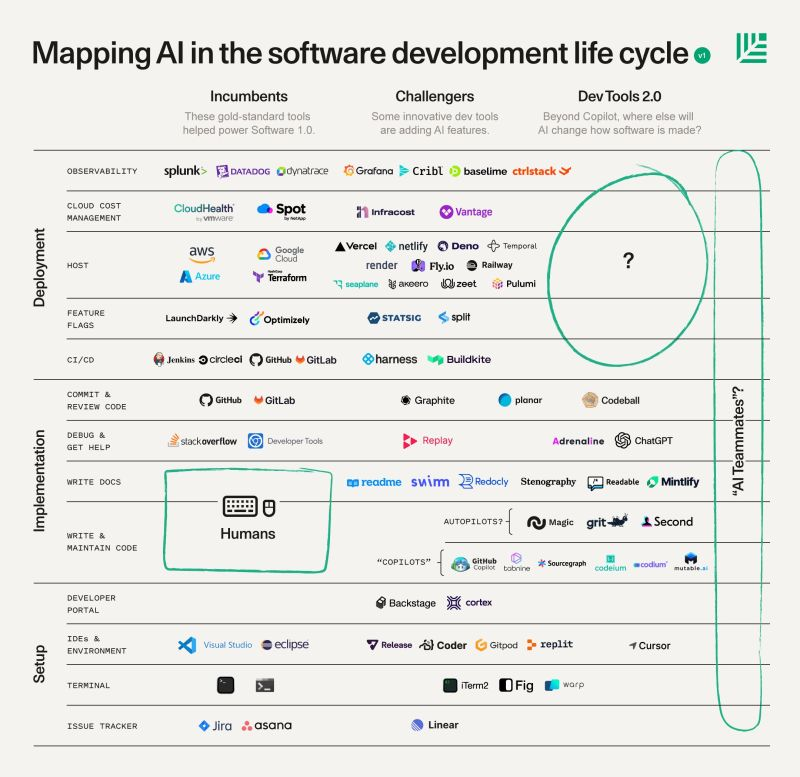

# Software Recommendations
Collection of assembled recommendations for various types of third party software plus some best practices.

## App Dev

### API documentation
- [swagger](https://swagger.io/) - API documentation and authoring

### build frameworks
- GitHub / GitLab / Bitbucket CI/CD
- [bazel](https://bazel.build/)

### front end dev
- [Vercel](https://vercel.com/) - Cloud based platform for devloping Next.js based front ends

### product analytics
- [objectiv.io](objectiv.io)
- [heap analytics](https://heap.io/)
- Google Analytics - not recommended. lots of better, modern alternatives

### Automated code migration
Frameworks to use as a part of making automated code changes in support of needs such as updating to a new version of a third party dependency or migrating from a monolith to microservices
- [Sourcegraph](https://about.sourcegraph.com/)

### low code / system integration
- [Pipedream](https://pipedream.com/) - in use for Accolite's internal needs.
- [Workato](https://www.workato.com/) - evaluated for Accolite's internal needs, but choose Pipedream based on pricing and functionality
- Unqork
- Appian
- Outsystems
- Boomi
- web flow
- Data Bricks
- [bubble.io](https://bubble.io/blog/no-code-for-engineers/)
- [Microsoft Power Automate](https://powerautomate.microsoft.com/en-us/)
- [Honeycode](https://www.honeycode.aws/) - AWS' low code framework
- Airtable
- Baserow

### Headless CMS
- [G2 Grid](https://www.g2.com/categories/headless-cms#grid) of various headless CMS
- [Very large list](https://jamstack.org/headless-cms/) of headless CMS
- [Contentful](https://www.contentful.com/platform/capabilities/) - seems like a strong commercial offering with a free tier. ~$850/mo for paid offering
- [Strapi](https://strapi.io/features) - Open source, lots of stars on GitHub, highly ranked on G2
- [Storyblok](https://www.storyblok.com/features) - Commercial. $90/mo for lowest tier
- [Sanity](https://www.sanity.io/) - Commercial. free tier, $100/mo for bottom paid tier

### low code web sites
- [Webflow](https://webflow.com/) - Used for Rise Health's initial site

### workflow
- [Activiti](https://www.activiti.org/)
- Nintex - Sharepoint based workflows. used at Envision
- Apache Airflow
- retool - recommended by multiple third parties
- [Zapier](https://zapier.com/) - Workflow automation
- [AppFlow](https://aws.amazon.com/appflow/) - AWS high level data and system intergation framework

### version control
- [Internal Accolite Git](https://gitlab.accolitedigital.com/) - can be used for customer and internal Accolite projects
- Bitbucket - Historically has been a low cost hosted Git, but may no longer be competitive with GitHub and GitLab
- GitLab - Can be lower cost than GitHub. Rich CI/CD capabilities
- GitHub - The dominant Cloud based Git
- AWS Code Commit - May make sense if your project is using other AWS CI/CD services like AWS Code Deploy
- Subversion (SVN) - Fallen out of favor in comparison to Git
- CVS - arguably the first modern version control system
- RCS / SCCS - old school

### rules engine
- drools
- [iLog](https://www.sparklinglogic.com/smarts-decision-manager/)
- clara (rbrush/clara-rules):\
this is more similar to Drools, in the sense that the knowledge base is constructed by inserting and retracting "objects" (Java objects or Clojure protocol instances) and querying by their properties. Bonus: it can easily work on top of Storm for distributed execution: rbrush/clara-storm.

### observability / logging / monitoring / exception monitoring
- [Sentry](https://sentry.io) - Open source alternative to Bugsnag
- ELK - Elastic Logstash Kibana. OG observability stack
- EFK - Elastic Fluentd Kibana. Alterntive to ELK
- Bugsnag - Great tool to capture runtime errors. Especially useful for capturing client side errors that are otherwise hard to get visibility into
- CuEgg - Accolite owned competitor to New Relic
- Sumo Logic
- New Relic

### Cloud monitoring
- [security_monkey](https://github.com/Netflix/security_monkey)
- [Cloud Checkr](https://cloudcheckr.com/)
- nagios for Linux logging

### User Auth
- FusionAuth. Auth as a Service. 
- Auth0 - More expensive than FusionAuth. Some past problems with outages.
- [Frontegg](https://frontegg.com/) - user auth plus admin
- [Stytch](https://stytch.com/)

### Reporting
- PowerBI. Good for internal use, especially at a Office 365 customer. Gets very expensive when you need to make reports available externally
- Tableau. Great for self service reporting, but can be very expensive. Typically requires significant dedicated admin personel.
- [Looker](https://www.looker.com/). Acquired by Google. Generally well regarded at startups.
- Sysense. Not recommended. Somewhat dated.
- qlik. Not recommended. Generally awful user feedback.

### infrastructure as code (IaC)
- terraform - better alternative to cloudformation
- cloudformation - AWS level infrastructure, e.g. S3 buckets, security groups
- cfnlint - automated config checker from Amazon.
- [Helm](https://helm.sh/) - Kubernetes deployment automation
- [Firefly](https://www.gofirefly.io/) - Generate IaC scripts from existing infrastructure (AWS and GCP only)
- [AWS Break Glass](https://github.com/awslabs/aws-break-glass-role) - Create a break glass role for emergency use in order to limit AWS production account access
- [Cloudposse AWS Terraform components](https://github.com/cloudposse/terraform-aws-components) - Super useful reusable Terraform components for AWS
- [Checkov](https://www.checkov.io/) - Policy as Code including validation against those policies

### Database / DDL IaC
- [Flyway](https://flywaydb.org/) - Java/JDBC based
- [Liquibase](https://www.liquibase.org/) 
Comparison from Liquibase vs. flyway https://www.liquibase.com/liquibase-vs-flyway
- [schemachange](https://github.com/Snowflake-Labs/schemachange) - From Snowflake. Based on flyway and not as actively matinained so likely less preferable
- [sqitch](https://sqitch.org/)
- [dbt](https://www.getdbt.com/) - More of an ETL tool, less about DDL

### certificate management
- [Venafi](https://www.venafi.com/) - automated certificate at scale
- AWS Certificate Manager

### system task automation
- ansible - useful for system level automation as opposed to terraform, cloudformation for IaC. can be used to automate patching and automated restarts
- puppet

## Data

### Data Flows/Pipelines
- Airtable
- [Dagster](https://dagster.io/blog/declarative-scheduling)

## Security

### Security management frameworks
- [Center for Internet Security](https://www.cisecurity.org/)
- [18 CIS Critical Security Controls](https://www.cisecurity.org/controls/cis-controls-list)
- [AWS Security Checklist](https://d1.awsstatic.com/whitepapers/Security/AWS_Security_Checklist.pdf)
- [Accolite AWS Security Questionaire](https://docs.google.com/spreadsheets/d/1SPkdCTBunjg9AKqej6RVhPaFjeHhr4nF/edit#gid=1012104534)

### VPN/remote access:
- [AWS Session Manager](https://docs.aws.amazon.com/systems-manager/latest/userguide/session-manager.html)
- [WireGuard](https://www.wireguard.com/)
- [Hashicorp Boundary](https://www.hashicorp.com/blog/hashicorp-boundary)
- [Teleport](https://goteleport.com/) - fka Gravitational

### MSSP / SOC as a service
- Arctic Wolf
- Deepwatch
- Esentire
- Reliaquest
- Ntirety
- Rapid7

### SSO / provisioning / deprovisioning
- Okta
- One Identity / One Login
- JumpCloud
- Ping
- Identity Automation
- BetterCloud
- Zluri

### security tools by category
- Build and test automation frameworks (Bazel, etc)
- Remote management access (AWS Session Manager, WireGuard, etc)
- Infrastructure as Code (Git, GitOps, Terraform, Ansible, etc)
- System monitoring (CloudWatch, ClearData, Rapid 7 Insight IDR, etc)
- Mirth level monitoring (Reference approach needed)
- Cloud configuration monitoring (Security Monkey, sensu, cfnlint, CloudChkr, ClearData, AWS Trusted Advisor)
- System vulnerability scanner (OpenVAS, clair)
- Intrusion detection (OSquery / kolide, GuardDuty, Macie)

### web app and library vulnerability scanners
- [snyk](https://snyk.io/) - automated open source library vulnerability management
- whitehat security - web app vulnerability scan

### OS and container vulnerability scanners
- clair - vulnerability scan of docker container
- openvas - system level vulnerability scanner including patch versions
- [simian army](https://github.com/Netflix/SimianArmy) - AWS security audit
- [Network Access Analyzer](https://docs.aws.amazon.com/vpc/latest/network-access-analyzer/what-is-vaa.html) - scan VPCs to identify publicly available resources; potentially - automate checks via [AWS Config Conformance Packs](https://docs.aws.amazon.com/config/latest/developerguide/conformance-packs.html)

### intrusion detection
- OSquery / kolide (UI) - intrusion detection. system level agent
- AWS guardduty
- [security onion](https://aws.amazon.com/marketplace/pp/prodview-vfwqkbpqxmqg6) - prebuilt AWS machine image with common security tools

### Risk scoring
- [BitSight](https://www.bitsight.com/) - Used by Ped Assoc to scan for risks at Accolite

### AWS security concepts
- AWS accounts - one account per "environment", dev, stage, prod, etc
- VPC to control ingress and egress - VPC flow logs to monitor traffic inbound and outbound
- sensu - custom alerts for changes to security groups
- [bigfix](https://help.hcltechsw.com/bigfix/9.2/patch/patch.html) - OS / system patch management
- logrythm - log aggregation

### SOC 2
- Vanta
- Tugboat
- Drata
- Secureframe
- [Laika](https://heylaika.com/)

## Other

### virtual desktop
- AWS WorkSpaces
- Workspot
  - no easy free trial option

### VoIP / phone system
- [RingCentral](https://www.ringcentral.com/)
- Ooma
- Dialpad

## Healthcare

### EHR
- Elation
- Healthie
- Canvas

## Other people's lists
- [The Book of Secret Knowlege](https://github.com/trimstray/the-book-of-secret-knowledge) - Excellent compendium of desktop and security tools, with an especially good section on automated system hardening.
- [Awesome Java](https://github.com/akullpp/awesome-java) - Great comprehensive list of Java frameworkds, libraries, and software.